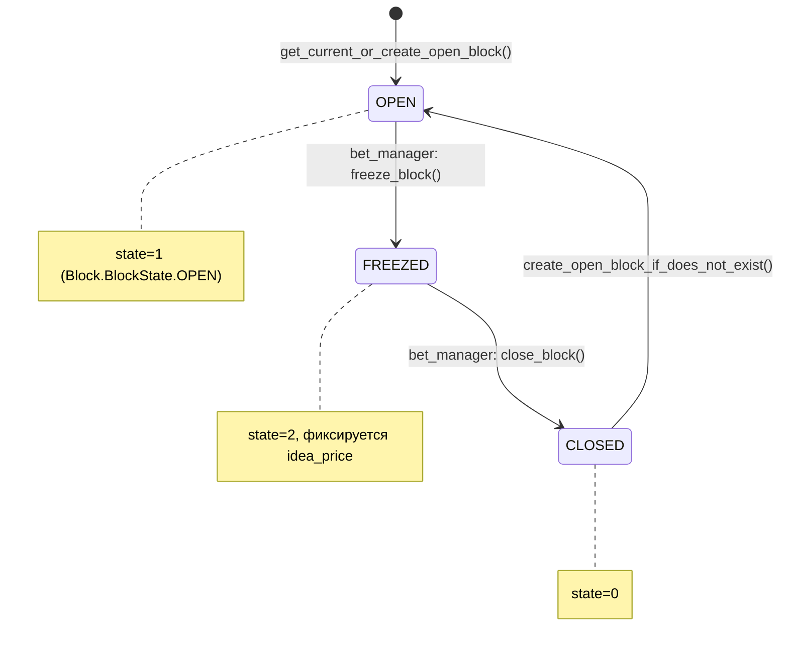
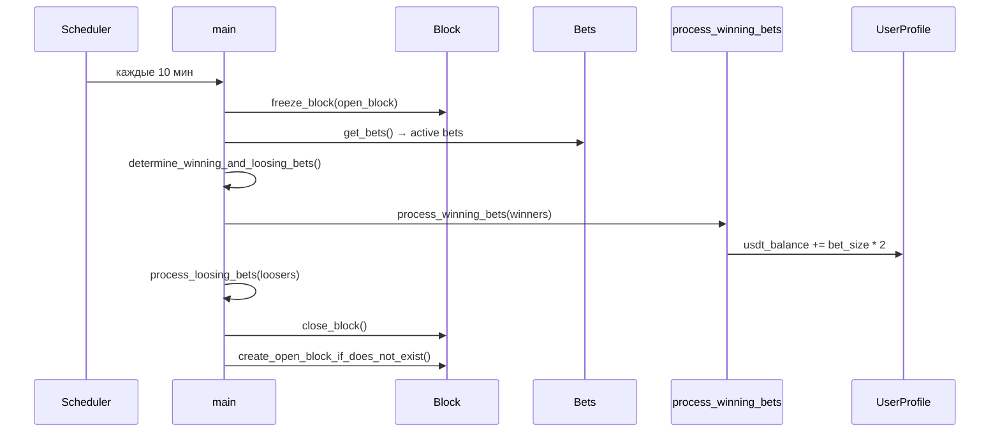

# LAUNCH_ROADMAP.md

Полное описание механики приложения Widepiper (Liquidity): диаграммы, потоки данных и ссылки на конкретный код.

---

## 1. Архитектура компонентов

```
┌─────────────────────────────────────────────────────────────────────────────┐
│                              ПОЛЬЗОВАТЕЛЬ                                     │
│  (браузер или Telegram Mini App → https://tg.ma8ka.com)                       │
└────────────────────────────────────────┬──────────────────────────────────────┘
                                         │
                                         ▼
┌─────────────────────────────────────────────────────────────────────────────┐
│  NGINX (порт 80/443) → proxy_pass 127.0.0.1:8001                             │
│  Файл: /etc/nginx/sites-available/tg.ma8ka.com                                │
│  Репо: proxy/nginx/sites-available/tg.ma8ka.com                             │
└────────────────────────────────────────┬──────────────────────────────────────┘
                                         │
         ┌───────────────────────────────┼───────────────────────────────┐
         ▼                               ▼                               ▼
┌─────────────────┐           ┌─────────────────────┐         ┌──────────────────┐
│  WEBAPP         │           │  BET_MANAGER        │         │  DEPOSIT_MONITOR │
│  (Gunicorn      │           │  (фоновый процесс   │         │  (manage.py      │
│   127.0.0.1:    │           │   каждые 10 мин)   │         │   monitor_       │
│   8001)         │           │                     │         │   deposits)      │
│  Django + API   │           │  Заморозка блока,  │         │  TRC20/BSC/TON   │
│  core/views,    │           │  определение       │         │  → usdt_balance  │
│  core/api_views │           │  победителей,      │         │  deposit_monitor │
└────────┬────────┘           │  начисление выигр. │         └────────┬─────────┘
         │                    └──────────┬──────────┘                  │
         │                               │                             │
         ▼                               ▼                             ▼
┌─────────────────────────────────────────────────────────────────────────────┐
│  БД (SQLite): webapp/db/db.sqlite3                                           │
│  Модели: webapp/core/models.py (UserProfile, Bet, Block, Transaction,        │
│          DepositTransaction)                                                  │
└─────────────────────────────────────────────────────────────────────────────┘
         │
         │  TELEGRAM BOT (отдельный процесс)
         │  telegram_bot/handlers.py — только кнопка «Приложение» → WEBAPP_URL
         ▼
┌─────────────────────────────────────────────────────────────────────────────┐
│  BSC / TRON / TON: цены токенов (DEX), депозиты, выводы                      │
└─────────────────────────────────────────────────────────────────────────────┘
```

---

## 2. Жизненный цикл блока и ставок



**Код состояний блока:**

| Состояние | Значение | Файл:строка |
|-----------|----------|-------------|
| OPEN      | `state=1` | `webapp/core/models.py` 40–42 (`BlockState.OPEN = 1`) |
| FREEZED   | `state=2` | `webapp/core/models.py` 42 (`BlockState.FREEZED = 2`) |
| CLOSED    | `state=0` | `webapp/core/models.py` 40 (`BlockState.CLOSED = 0`) |

**Создание открытого блока:**  
`webapp/core/blocks.py` 8–22 — `get_current_or_create_open_block()`: ищет блок с `state=1`, если нет — создаёт с `block_hash`, `prev_block_hash`, `idea_price` из DEX.

**Заморозка/закрытие в bet_manager:**  
- Заморозка: `bet_manager/__main__.py` 33–37 — `freeze_block()`: `block.state = 2`, сохраняет текущую цену IDEA.  
- Закрытие: `bet_manager/__main__.py` 183–187 — `close_block()`: `block.state = 0`.

---

## 3. Механика ставки (Bet)

### 3.1 Создание ставки (API)

**Эндпоинт:** `POST /api/v1/bet/create/`  
**Код:** `webapp/core/api_views.py` 163–247 (`create_bet`).

**Последовательность:**

1. Валидация тела запроса (размер ставки, процент) — `api_views.py` 168–171.
2. Проверка внутреннего баланса USDT: ставка не больше `user_profile.usdt_balance` — строки 182–188.
3. Цены MATTER/IDEA с BSC (Moralis/DEX) — строки 192–198.
4. Расчёт **bet_ratio** (прогноз соотношения IDEA/MATTER на конец блока):
   - `cur_ratio = idea_price / matter_price`
   - `bet_ratio = (1 + bet_percent/100) * cur_ratio`  
   Строки 201–209.
5. Сохранение ставки в БД и **списание с внутреннего баланса**:
   - `user_profile.usdt_balance -= bet_size` — строки 218–220.
6. Создание записи `Transaction` (тип 1 — deposit, привязка к текущему открытому блоку) — строки 227–235.

**Привязка к блоку:**  
Текущий открытый блок берётся из `get_current_or_create_open_block()` — вызов в `api_views.py` 234, реализация в `webapp/core/blocks.py` 8–22.

### 3.2 Диаграмма: создание ставки

```
[Клиент]  POST /api/v1/bet/create/  { bet_size, bet_percent, wallet_address }
                │
                ▼
         create_bet()  ──►  usdt_balance >= bet_size?
                │                    │
                │ да                  │ нет → 400
                ▼                    │
         Цены MATTER/IDEA (BSC)
                │
                ▼
         bet_ratio = (1 + bet_percent/100) * (idea_price/matter_price)
                │
                ▼
         Bet.save()  +  user_profile.usdt_balance -= bet_size
                │
                ▼
         Transaction.create(type=1, block=open_block, bet=bet)
                │
                ▼
         201 + данные ставки
```

---

## 4. Bet manager: определение победителей и начисление выигрыша

**Запуск:** фоновый процесс `python -m bet_manager`, цикл каждые **10 минут** (`BLOCK_REFRESH_PERIOD = 10*60` — `bet_manager/__main__.py` 24–25, 215–216).

### 4.1 Основной цикл

**Код:** `bet_manager/__main__.py` 194–223 (`main()`), 215–230 (`scheduled_main`).

**Шаги:**

| Шаг | Действие | Функция | Строки |
|-----|----------|---------|--------|
| 1 | Получить текущий открытый блок | `get_open_block()` | 195 |
| 2 | Заморозить блок (state=2, зафиксировать idea_price) | `freeze_block()` | 196 |
| 3 | Выгрузить активные ставки (is_active=True, deleted_at=None) | `get_bets()` | 199 |
| 4 | Определить победителей и проигравших по текущему ratio IDEA/MATTER | `determine_winning_and_loosing_bets()` | 206 |
| 5 | Начислить выигрыш победителям (внутренний баланс) | `process_winning_bets()` | 211 |
| 6 | Отметить проигравших | `process_loosing_bets()` | 212 |
| 7 | Закрыть блок (state=0) | `close_block()` | 213 |
| 8 | Создать новый открытый блок при необходимости | `create_open_block_if_does_not_exist()` | 214 |

### 4.2 Кто считается победителем

**Код:** `bet_manager/__main__.py` 60–82 — `determine_winning_and_loosing_bets()`.

- Текущий ratio: `current_ratio = get_token_priceBCS(IDEA) / get_token_priceBCS(MATTER)` (68–70).
- Ставки сортируются по `abs(current_ratio - bet.bet_ratio)` (76–79).
- **Победители** — первая половина (ближайшие к фактическому ratio):  
  `winners = sorted_bets[: ceil(len/2)]` (81).  
- **Проигравшие** — вторая половина (82).

Если ставка одна — она выигрывает (65–66). Если не удалось получить цены — все считаются победителями (73–74).

### 4.3 Начисление выигрыша (вознаграждение)

**Код:** `bet_manager/__main__.py` 85–127 — `process_winning_bets()`.

- Для каждой ставки-победителя:
  - `bet.is_winning = True`, `bet.is_active = False` (96–98).
  - **Выигрыш:** `win_amount = bet_size * 2` (106).
  - **Зачисление на внутренний баланс:** `user_profile.usdt_balance += win_amount` (107–108).
  - Лог в `bet_manager.log` (110–113).
  - Создание `Transaction` (type=1, to_wallet="internal_balance") (115–123).

**Важно:** в коде **нет** отправки MATTER или USDT на кошелёк пользователя в момент определения победителя. Начисление только в поле `UserProfile.usdt_balance`. Реальные выплаты — через вывод (withdraw).

### 4.4 Диаграмма: цикл bet_manager



---

## 5. Депозиты: от блокчейна до баланса

### 5.1 Запуск мониторинга

**Команда:** `python webapp/manage.py monitor_deposits --interval 60`  
**Код команды:** `webapp/core/management/commands/monitor_deposits.py` 27–48: в цикле вызываются `monitor.run()` и `auto_credit_confirmed_deposits()`.

### 5.2 Один проход мониторинга

**Код:** `webapp/core/deposit_monitor.py` 509–549 — `DepositMonitor.run()`.

1. **TRC20:** `check_trc20_deposits()` — TronGrid API, адрес из `DEPOSIT_ADDRESS_TRC20` (61–94, 518–520).
2. **BSC:** `check_bsc_deposits()` — BscScan API, адрес `DEPOSIT_ADDRESS_BSC` (524–527).
3. **TON:** `check_ton_deposits()` — адрес `DEPOSIT_ADDRESS_TON` (530–533).
4. Для каждой найденной транзакции: `process_deposit(deposit_data)` → создание/обновление `DepositTransaction` (539–540).
5. Если статус PENDING: `confirm_deposit(deposit)` (по числу подтверждений: TRC20=19, BSC=15, TON=1 — строки 32–36).
6. После CONFIRMED: `auto_credit_deposit(deposit)` — поиск пользователя и зачисление (544–546).

### 5.3 Зачисление на баланс

**Поиск пользователя:**  
`deposit_monitor.py` 551–721 — `auto_credit_deposit()`: пользователь ищется по `crypto_wallet_address` или `ton_wallet_address` == `from_address` депозита.

**Списание на баланс:**  
`deposit_monitor.py` 454–507 — `credit_deposit()`:
- `user_profile.usdt_balance += deposit.amount` (467).
- Статус депозита → `CREDITED`, заполняются `credited_at`, `user` (471–474).

**Внешняя функция для всех подтверждённых:**  
`deposit_monitor.py` 661–727 — `auto_credit_confirmed_deposits()`: перебирает подтверждённые депозиты, ищет пользователя по адресу и вызывает `monitor.credit_deposit(deposit, user_profile.user)` (721).

### 5.5 Диаграмма: депозит

```
[Блокчейн TRC20/BSC/TON]  →  USDT на DEPOSIT_ADDRESS_*
                │
                ▼
    monitor.run()  →  check_*_deposits()  →  process_deposit()
                │
                ▼
    DepositTransaction (PENDING → CONFIRMED по confirmations)
                │
                ▼
    auto_credit_deposit()  →  User по from_address
                │
                ▼
    credit_deposit()  →  usdt_balance += amount, status=CREDITED
```

**Строки кода:**

| Действие | Файл | Строки |
|----------|------|--------|
| Константы подтверждений | `deposit_monitor.py` | 32–36 |
| run(): опрос сетей | `deposit_monitor.py` | 509–549 |
| credit_deposit(): +balance | `deposit_monitor.py` | 454–507 (467 — += amount) |
| auto_credit_confirmed_deposits | `deposit_monitor.py` | 661–727 |

---

## 6. Вывод (Withdraw)

**Эндпоинт:** `POST /api/v1/withdraw/`  
**Код:** `webapp/core/api_views.py` 653–751.

**Тело запроса:** `{ "amount": float, "address": str, "network": "TRC20"|"BSC"|"TON" }`.

**Логика:**

1. Проверка суммы и адреса (662–690).
2. Проверка баланса: `amount <= user_profile.usdt_balance` (693–697).
3. Минимум вывода: 0.001 USDT (699–704).
4. Отправка в сеть (707–721):
   - TRC20: `withdrawal.send_usdt_trc20(address, amount)`  
   - BSC: `withdrawal.send_usdt_bsc(address, amount)`  
   - TON: `withdrawal.send_usdt_ton(address, amount)`  
   Реализация: `webapp/core/withdrawal.py`.
5. После успешной отправки: `user_profile.usdt_balance -= amount` (729–730).

**Строки:** списание баланса — `api_views.py` 729–730; вызовы сетей — 708–721.

---

## 7. Игры (Flappy Bird): начисление USDT

**Эндпоинт:** `POST /api/v1/games/earn/`  
**Код:** `webapp/core/api_views.py` 1073–1125 — `game_earn()`.

**Тело:** `{ "amount": float }`. Лимит: **0 < amount ≤ 10** USDT за раз (1095–1099).

**Начисление:** `user_profile.usdt_balance += amount` (1102–1103).

**Клиент:** `webapp/core/static/scripts/flappy-bird.js`: после игры вызов `fetch('/api/v1/games/earn/', { method: 'POST', body: JSON.stringify({ amount }) })` (281–288). Награда за трубу: `REWARD_PER_PIPE = 0.01` (15).

---

## 8. Telegram-бот

**Код:** `telegram_bot/handlers.py`.

- **/start, /app:** вызывают `standart_webapp_response()` (11–12, 19–20).
- **standart_webapp_response()** (23–35):
  - Устанавливает кнопку меню «Приложение» с `WebAppInfo(webapp_url)` — строка 26.
  - Отправляет сообщение с Inline-кнопкой, открывающей Mini App по `WEBAPP_URL` — строки 29–34.

**Переменная окружения:** `WEBAPP_URL` (например `https://tg.ma8ka.com/`) — из `.env`.

Бот не содержит логики ставок/балансов — только открытие веб-приложения.

---

## 9. Деплой и конфигурация

### 9.1 Запуск без Docker

**Скрипт:** `scripts/start-prod-no-docker.sh`  
- Подготовка каталогов и симлинков для `db/`, `staticfiles/` (webapp/db, webapp/static).
- `manage.py migrate`, `manage.py collectstatic`.
- Запуск в фоне: **webapp** (Gunicorn 127.0.0.1:8001), **telegram_bot**, **bet_manager**, **deposit_monitor** (команда `monitor_deposits --interval 60`).

**Остановка:** `scripts/stop-prod-no-docker.sh` (по PID из `.pids/`).

### 9.2 Nginx для tg.ma8ka.com

**Файл в репо:** `proxy/nginx/sites-available/tg.ma8ka.com`  
**На сервере:** `/etc/nginx/sites-available/tg.ma8ka.com`, симлинк в `sites-enabled/`.

- Порт 80: редирект на HTTPS, `/.well-known/acme-challenge/` для certbot.
- Порт 443: `proxy_pass http://127.0.0.1:8001`, `location /static/` → `alias .../staticfiles/`.

**Важно:** backend должен слушать **8001**, если порт 8000 занят (например uvicorn).

### 9.3 Переменные окружения (.env)

Основные для механики и запуска:

| Переменная | Назначение |
|------------|------------|
| `SECRET_KEY` | Django |
| `WEBAPP_URL` | URL веб-приложения (для бота и фронта) |
| `TELEGRAM_BOT_TOKEN` | Telegram Bot API |
| `DEPOSIT_ADDRESS_TRC20`, `DEPOSIT_ADDRESS_BSC`, `DEPOSIT_ADDRESS_TON` | Адреса для приёма депозитов |
| `APP_WALLET`, `APP_WALLET_PRIVATE_KEY` | Кошелёк приложения (BSC и др.) |
| `MATTER_TOKEN_ADDRESS`, `IDEA_TOKEN_ADDRESS` | BSC-токены для ratio и ставок |
| `MORALIS_API_KEY`, `BSC_API_KEY`, `INFURA_API_KEY` | Цены и RPC |
| Ключи вывода (TRC20/BSC/TON) | См. `.env.example` |

Полный список и комментарии — в `.env.example`.

---

## 10. Сводная таблица: ключевые файлы и строки

| Механика | Файл | Строки / функция |
|----------|------|-------------------|
| Состояния блока | `webapp/core/models.py` | 40–42 BlockState, 46–56 Block |
| Модель ставки | `webapp/core/models.py` | 58–80 Bet |
| Внутренний баланс | `webapp/core/models.py` | 20 usdt_balance |
| Создание открытого блока | `webapp/core/blocks.py` | 8–22 get_current_or_create_open_block |
| API: создание ставки | `webapp/core/api_views.py` | 163–247 create_bet |
| API: списание при ставке | `webapp/core/api_views.py` | 218–220 |
| Bet manager: цикл | `bet_manager/__main__.py` | 194–223 main, 215–230 scheduled_main |
| Bet manager: победители | `bet_manager/__main__.py` | 60–82 determine_winning_and_loosing_bets |
| Bet manager: начисление выигрыша | `bet_manager/__main__.py` | 85–127 process_winning_bets, 106–108 |
| Депозиты: run | `webapp/core/deposit_monitor.py` | 509–549 run |
| Депозиты: зачисление | `webapp/core/deposit_monitor.py` | 454–507 credit_deposit, 467 |
| Вывод | `webapp/core/api_views.py` | 653–751 withdraw, 729–730 |
| Игры: начисление | `webapp/core/api_views.py` | 1073–1125 game_earn, 1102–1103 |
| Telegram: кнопка приложения | `telegram_bot/handlers.py` | 23–35 standart_webapp_response |

---

*Документ актуален для репозитория widepiper (Liquidity), домен tg.ma8ka.com.*
